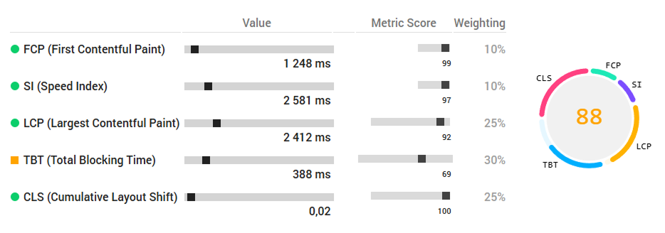
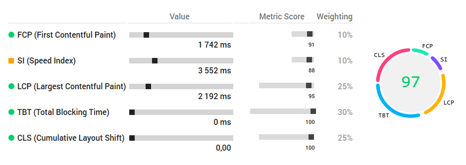
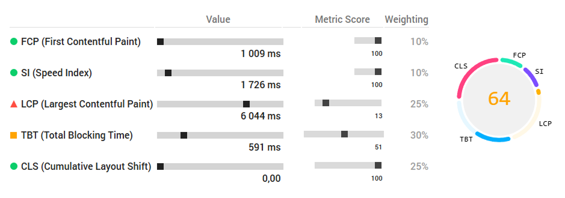
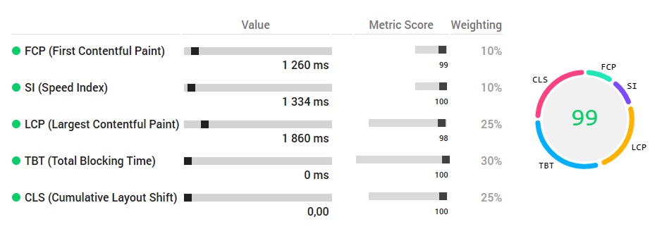

# Compass — Corporate Website (Front-End Development)

Production corporate website developed as a real-world front-end project with a focus on performance, accessibility, and SEO best practices.

🔗 [**Live Demo**](https://compass.spekter.solutions)  

---

## Project Overview

The project involved the full front-end implementation of the website, including responsive layout development, UI behavior, performance optimization, and accessibility improvements.

The focus of the work was to deliver a stable, fast, and scalable front-end solution aligned with real business and production requirements, ensuring clarity of content, predictable user experience, and strong technical quality across devices.

---

## Scope of Work

- Semantic HTML markup
- Responsive layout implementation across breakpoints
- UI behavior and interaction logic
- Performance optimization (Core Web Vitals)
- Accessibility improvements (A11Y)
- SEO-friendly page structure

---

## Tech Stack

- **HTML5** — semantic and accessible markup
- **CSS3 / SCSS** — modular styling, BEM methodology
- **JavaScript (Vanilla)** — lightweight UI and interaction logic
- **WebP / WebM** — optimized media formats for web delivery
- **Accessibility** — aria attributes, focus handling, modal roles  
- Mobile-first adaptive layout  

---

## Front-End Implementation Details

### Layout & UI

- Clear visual hierarchy and spacing system
- Card-based navigation and content blocks
- Sticky header with scroll-aware behavior
- Fully responsive layout (desktop / tablet / mobile)

### Performance Optimization

- Explicit image dimensions to prevent layout shifts
- Lazy loading for non-critical images
- Optimized media formats (WebP, WebM)
- Reduced render-blocking resources

### Accessibility

- Semantic heading structure
- Meaningful `alt` attributes
- Keyboard-friendly navigation
- Proper use of ARIA attributes
- `aria-current="page"` for active navigation states

### SEO Considerations

- Logical heading order
- Readable content structure
- Clean internal linking
- Fast initial load and low CLS

---

## Lighthouse Performance

Performance optimization was carried out as part of the front-end delivery process.

---

## 📊 Lighthouse Metrics — Before → After Optimization Main Page

| Metric            | Before                                   | After                                    | Improvement |
|-------------------|-------------------------------------------|-------------------------------------------|-------------|
| **Performance**   |   |   | ↑ +29       |
| **Accessibility** |  |  | ↑ +1        |
| **Best Practices**|  |  | ↑ +29       |
| **SEO**           |  |  | —           |


### 🖼 Before / After 

|  |  |
|:--:|:--:|
| **Before** | **After** |

---

## 📊 Lighthouse Metrics — Before → After Optimization Blog Page

| Metric            | Before                                   | After                                    | Improvement |
|-------------------|-------------------------------------------|-------------------------------------------|-------------|
| **Performance**   |   |   | ↑ +36       |
| **Accessibility** |  |  | ↑ +34        |
| **Best Practices**|  |  | —       |
| **SEO**           |  |  | ↑ +10           |


### 🖼 Before / After 

|  |  |
|:--:|:--:|
| **Before** | **After** |

---

### 🎯 JSON reports
- [Before JSON](./media/json/before.json)
- [After JSON](./media/json/after.json)
- [Before Blog JSON](./media/json/before-blog.json)
- [After Blog JSON](./media/json/after-blog.json)

---

## Project Structure

```  
prod/
 ├── assets/
 │    ├── css/
 │    ├── fonts/
 │    ├── img/
 │    │    ├── favicons/
 │    │    ├── gallery/
 │    │    ├── logos/
 │    │    ├── preload/
 │    │    ├── promo/
 │    │    └── og/
 │    ├── js/
 │    └── scss/
 ├── blog.html
 ├── index.html
 └── site.webmanifest
```

---

## Author

### Anzhelika Spekter  
UI/UX Product Designer & Front-End Developer

Front-end focus:
- Design-to-code workflows
- Performance-oriented UI implementation
- Scalable and maintainable front-end architecture

